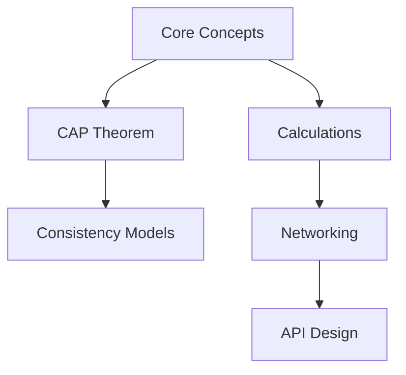

# System Design Fundamentals
{: .no_toc }

Master the core concepts that form the foundation of all system design.
{: .fs-6 .fw-300 }

---

## Overview

Before diving into complex distributed systems, it's crucial to understand the fundamental concepts that guide all system design decisions. These principles apply whether you're building a simple web application or a planet-scale distributed system.

## What You'll Learn

This section covers the essential building blocks that every engineer should master:

- **Performance Concepts** - Understanding scalability, latency, and throughput
- **Reliability Principles** - Availability, fault tolerance, and consistency
- **Trade-offs** - The CAP theorem and real-world compromises
- **Estimation Techniques** - Back-of-the-envelope calculations
- **Networking Basics** - Protocols, APIs, and communication patterns

## Why Fundamentals Matter

{: .highlight }
Strong fundamentals enable you to:
- Make informed architectural decisions
- Understand trade-offs in system design
- Communicate effectively with other engineers
- Debug complex distributed systems
- Design scalable solutions from scratch

## Topics in This Section

1. **[Core Concepts](/fundamentals/core-concepts)** - Scalability, availability, and performance
2. **[CAP Theorem](/fundamentals/cap-theorem)** - Consistency, availability, and partition tolerance
3. **[Consistency Models](/fundamentals/consistency-models)** - Strong, eventual, and weak consistency
4. **[Back-of-Envelope Calculations](/fundamentals/calculations)** - Estimating system requirements
5. **[Networking Fundamentals](/fundamentals/networking)** - Protocols and communication patterns
6. **[API Design](/fundamentals/api-design)** - REST, GraphQL, gRPC, and WebSockets

## Learning Path

For beginners, we recommend following this sequence:

## Prerequisites

- Basic programming knowledge
- Understanding of client-server architecture
- Familiarity with HTTP/HTTPS
- Basic database concepts (SQL/NoSQL)

## Time to Complete

- **Junior Engineers**: 2-3 weeks
- **Review for Mid-Level**: 1 week
- **Quick Refresh**: 2-3 days

## Next Steps

Once you've mastered the fundamentals, move on to:
- [Infrastructure Components](/components/) - Learn about specific technologies
- [Design Patterns](/patterns/) - Apply concepts to common patterns
- [Case Studies](/case-studies/) - See real-world applications

---

{: .note }
**Pro Tip**: Don't rush through fundamentals. These concepts will be referenced throughout your entire career. Take time to deeply understand each principle.

## Additional Resources

### Online Courses
- [System Design Primer](https://github.com/donnemartin/system-design-primer)
- [ByteByteGo - System Design Fundamentals](https://bytebytego.com)

### Books
- *Designing Data-Intensive Applications* by Martin Kleppmann (Chapters 1-3)
- *System Design Interview* by Alex Xu (Volume 1, Chapters 1-2)

### Videos
- [Gaurav Sen's System Design Playlist](https://www.youtube.com/playlist?list=PLMCXHnjXnTnvo6alSjVkgxV-VH6EPyvoX)
- [Hussein Nasser - System Design Concepts](https://www.youtube.com/@hnasr)

---

Ready to start? Begin with [Core Concepts](/fundamentals/core-concepts) →
