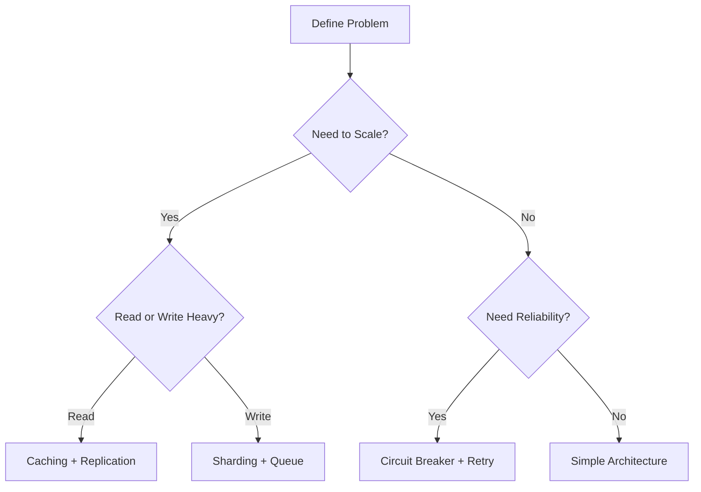

# System Design Patterns
{: .no_toc }

Common architectural patterns and best practices for building distributed systems.
{: .fs-6 .fw-300 }

---

## Overview

Design patterns are proven solutions to common problems in system design. Understanding these patterns helps you design better systems faster and communicate architectural decisions effectively.


*Common system design patterns and architectural styles.*

## What You'll Learn

- **Architectural Patterns**: Microservices, Event-Driven, CQRS
- **Scalability Patterns**: Sharding, Replication, Caching strategies
- **Reliability Patterns**: Circuit Breaker, Bulkhead, Retry logic
- **Data Patterns**: Event Sourcing, Saga, Outbox pattern
- **Communication Patterns**: API Gateway, Service Mesh, Message Broker

## Pattern Categories

### Architecture Patterns
Core architectural styles for organizing your system.


*Comparison between monolithic and microservices architectures.*

- **Monolithic Architecture**
- **Microservices Architecture**
- **Service-Oriented Architecture (SOA)**
- **Event-Driven Architecture**
- **Serverless Architecture**
- **Layered Architecture**

### Scalability Patterns
Techniques for handling growth and load.

- **Database Sharding**
- **Database Replication** (Master-Slave, Master-Master)
- **Horizontal Scaling**
- **Vertical Scaling**
- **Load Balancing**
- **Caching Layers**

### Reliability Patterns
Patterns for building fault-tolerant systems.

- **Circuit Breaker**
- **Bulkhead**
- **Timeout**
- **Retry with Exponential Backoff**
- **Rate Limiting**
- **Graceful Degradation**
- **Health Checks**

### Data Management Patterns
Handling data consistency and transactions.

- **Event Sourcing**
- **CQRS (Command Query Responsibility Segregation)**
- **Saga Pattern**
- **Outbox Pattern**
- **Two-Phase Commit**
- **Change Data Capture (CDC)**

### Communication Patterns
Inter-service and client-server communication.

- **Request-Response**
- **Publish-Subscribe**
- **Event Streaming**
- **API Gateway**
- **Backend for Frontend (BFF)**
- **Service Mesh**

## Topics in This Section

### Coming Soon
1. **Microservices Architecture** - Design, benefits, challenges
2. **Event-Driven Architecture** - Events, streams, and choreography
3. **CQRS & Event Sourcing** - Separating reads and writes
4. **Database Patterns** - Sharding, replication, partitioning
5. **Caching Strategies** - When and how to cache
6. **Resilience Patterns** - Circuit breakers, retries, bulkheads
7. **API Design Patterns** - REST, GraphQL, gRPC
8. **Security Patterns** - Authentication, authorization, encryption

## Pattern Selection Guide

### How to Choose the Right Pattern



### Decision Matrix

| Pattern | Complexity | Scalability | Reliability | Use When |
|:--------|:-----------|:------------|:------------|:---------|
| **Monolith** | Low | Low | Medium | Small apps, MVPs |
| **Microservices** | High | High | High | Large teams, scale |
| **Event-Driven** | Medium | High | High | Async workflows |
| **CQRS** | High | Very High | High | Complex read/write patterns |
| **Serverless** | Low | Auto | Medium | Variable load, simple functions |

## Common Pattern Combinations

### Pattern 1: E-Commerce Platform

```
API Gateway
    ↓
Microservices (Order, Payment, Inventory)
    ↓
Event Bus (Kafka)
    ↓
CQRS (Write DB + Read DB)
    ↓
Cache Layer (Redis)
```

**Patterns Used**:
- Microservices for modularity
- API Gateway for routing
- Event-Driven for order processing
- CQRS for read/write separation
- Caching for product catalog

### Pattern 2: Social Media Feed

```
Load Balancer
    ↓
Application Servers
    ↓
Write-Through Cache
    ↓
Sharded Database
    ↓
CDN for Media
```

**Patterns Used**:
- Load balancing for distribution
- Caching for fast reads
- Sharding for write scalability
- CDN for media delivery

### Pattern 3: Real-Time Analytics

```
Event Producers
    ↓
Message Queue (Kafka)
    ↓
Stream Processing (Flink)
    ↓
Time-Series DB
    ↓
Visualization Dashboard
```

**Patterns Used**:
- Event Streaming for real-time data
- Stream Processing for aggregation
- Specialized DB for time-series
- Pub-Sub for multiple consumers

## Real-World Examples

### Netflix: Microservices + Event-Driven

**Architecture**:
```
700+ Microservices
    ↓
Zuul API Gateway
    ↓
Eureka Service Discovery
    ↓
Hystrix Circuit Breaker
    ↓
Kafka Event Bus
```

**Patterns**:
- Microservices (800+ services)
- API Gateway (Zuul)
- Circuit Breaker (Hystrix)
- Service Discovery (Eureka)
- Event-Driven (Kafka)

**Results**:
- Handles 1 billion hours of streaming per week
- 99.99% availability
- Thousands of deployments per day

### Uber: Event Sourcing + CQRS

**Architecture**:
```
Mobile Apps
    ↓
API Gateway
    ↓
Event Store (Kafka)
    ↓
CQRS (Write + Read Models)
    ↓
Geo-Distributed DBs
```

**Patterns**:
- Event Sourcing for trip history
- CQRS for real-time views
- Saga for distributed transactions
- Geo-partitioning for low latency

**Results**:
- Supports 10M+ rides per day
- Sub-second matching
- Global availability

### Amazon: Service-Oriented Architecture

**Architecture**:
```
Thousands of Services
    ↓
API Gateway
    ↓
DynamoDB (AP)
    ↓
S3 for Storage
    ↓
Lambda for Functions
```

**Patterns**:
- SOA (service-oriented)
- Event-Driven with SQS/SNS
- Eventual consistency
- Serverless with Lambda
- Two-Pizza team ownership

**Results**:
- Handles peak loads (Prime Day)
- Independent service deployment
- High availability

## Anti-Patterns to Avoid

### 1. Distributed Monolith
{: .text-red-200}

**Problem**: Microservices that are tightly coupled and must deploy together.

**Symptoms**:
- Shared databases across services
- Synchronous calls for every operation
- Cannot deploy services independently

**Solution**:
- Proper service boundaries
- Async communication
- Database per service

### 2. Premature Optimization
{: .text-red-200}

**Problem**: Over-engineering before understanding actual needs.

**Symptoms**:
- Complex architecture for simple problems
- Using cutting-edge tech without justification
- Optimizing before measuring

**Solution**:
- Start simple, evolve based on needs
- Measure before optimizing
- Use boring technology

### 3. Data Duplication Hell
{: .text-red-200}

**Problem**: Too much data duplication without proper synchronization.

**Symptoms**:
- Same data in multiple databases
- Inconsistency across services
- No source of truth

**Solution**:
- Define data ownership
- Use event sourcing or CDC
- Implement eventual consistency properly

### 4. Chatty Microservices
{: .text-red-200}

**Problem**: Too many synchronous calls between services.

**Symptoms**:
- High latency
- Cascading failures
- Network congestion

**Solution**:
- Batch requests
- Use async messaging
- Cache frequently accessed data
- Consider service boundaries

## Pattern Implementation Checklist

### Before Implementing

- [ ] Understand the problem thoroughly
- [ ] Consider simpler alternatives
- [ ] Evaluate team expertise
- [ ] Assess operational overhead
- [ ] Calculate cost implications
- [ ] Define success metrics

### During Implementation

- [ ] Document architecture decisions (ADRs)
- [ ] Set up monitoring and alerts
- [ ] Implement health checks
- [ ] Add proper logging
- [ ] Write integration tests
- [ ] Plan for rollback

### After Implementation

- [ ] Monitor key metrics
- [ ] Gather feedback
- [ ] Document lessons learned
- [ ] Iterate based on data
- [ ] Share knowledge with team

## Trade-offs Summary

| Pattern | Pros | Cons | Complexity |
|:--------|:-----|:-----|:-----------|
| **Microservices** | Scalability, independence | Distributed complexity | High |
| **Monolith** | Simplicity, easy to develop | Limited scalability | Low |
| **Event-Driven** | Loose coupling, scalability | Eventual consistency | Medium |
| **CQRS** | Optimized reads/writes | Two models to maintain | High |
| **Saga** | Distributed transactions | Complex error handling | High |
| **Circuit Breaker** | Fault isolation | Additional latency | Medium |

## Best Practices

### 1. Start Simple

{: .highlight }
Begin with the simplest architecture that meets your needs. Add complexity only when required and justified by data.

### 2. Design for Failure

Assume every component will fail. Build resilience through:
- Timeouts
- Retries
- Circuit breakers
- Graceful degradation

### 3. Optimize for Observability

Make your system observable from day one:
- Structured logging
- Distributed tracing
- Metrics and dashboards
- Alerting

### 4. Document Decisions

Use Architecture Decision Records (ADRs) to document:
- Context
- Decision
- Consequences
- Alternatives considered

### 5. Measure Everything

{: .important }
"If you can't measure it, you can't improve it." - Peter Drucker

Track:
- Latency (p50, p95, p99)
- Error rates
- Request rates
- Resource utilization

## Interview Preparation

### Common Questions

**Q: "When would you use microservices vs monolith?"**

<details markdown="1">
<summary>Answer</summary>

**Use Monolith when**:
- Small team (< 10 developers)
- Simple domain
- Rapid prototyping/MVP
- Limited operational expertise
- Low traffic

**Use Microservices when**:
- Large team (multiple teams)
- Complex domain with clear boundaries
- Need independent scaling
- Different technology requirements per service
- High traffic with varied load patterns

**Real-world**: Most companies start with monolith and evolve to microservices as they grow. Don't start with microservices unless you have a clear need.

</details>

**Q: "How do you handle distributed transactions in microservices?"**

<details markdown="1">
<summary>Answer</summary>

**Options**:

1. **Saga Pattern** (Recommended)
   - Choreography: Event-based coordination
   - Orchestration: Central coordinator
   - Compensating transactions for rollback

2. **Two-Phase Commit**
   - Coordinator + participants
   - All or nothing
   - High latency, not recommended for microservices

3. **Eventual Consistency**
   - Accept temporary inconsistency
   - Eventually consistent through events
   - Best for many use cases

**Real-world**: Saga pattern is most common. Example: Order → Payment → Inventory, with compensation if payment fails.

</details>

---

## Next Steps

- Review [Core Concepts](../fundamentals/core-concepts) for foundation knowledge
- Study [Infrastructure Components](../components/) to understand building blocks
- Practice with [Interview Problems](../interview-prep/)

---

## Additional Resources

### Books
- *Microservices Patterns* by Chris Richardson
- *Building Microservices* by Sam Newman
- *Enterprise Integration Patterns* by Gregor Hohpe

### Websites
- [Microservices.io](https://microservices.io/patterns/index.html)
- [Martin Fowler's Blog](https://martinfowler.com/)
- [Microsoft Architecture Patterns](https://docs.microsoft.com/en-us/azure/architecture/patterns/)

### Videos
- [Mastering Chaos - A Netflix Guide](https://www.youtube.com/watch?v=CZ3wIuvmHeM)
- [GOTO Conferences - Microservices](https://www.youtube.com/results?search_query=goto+microservices)
